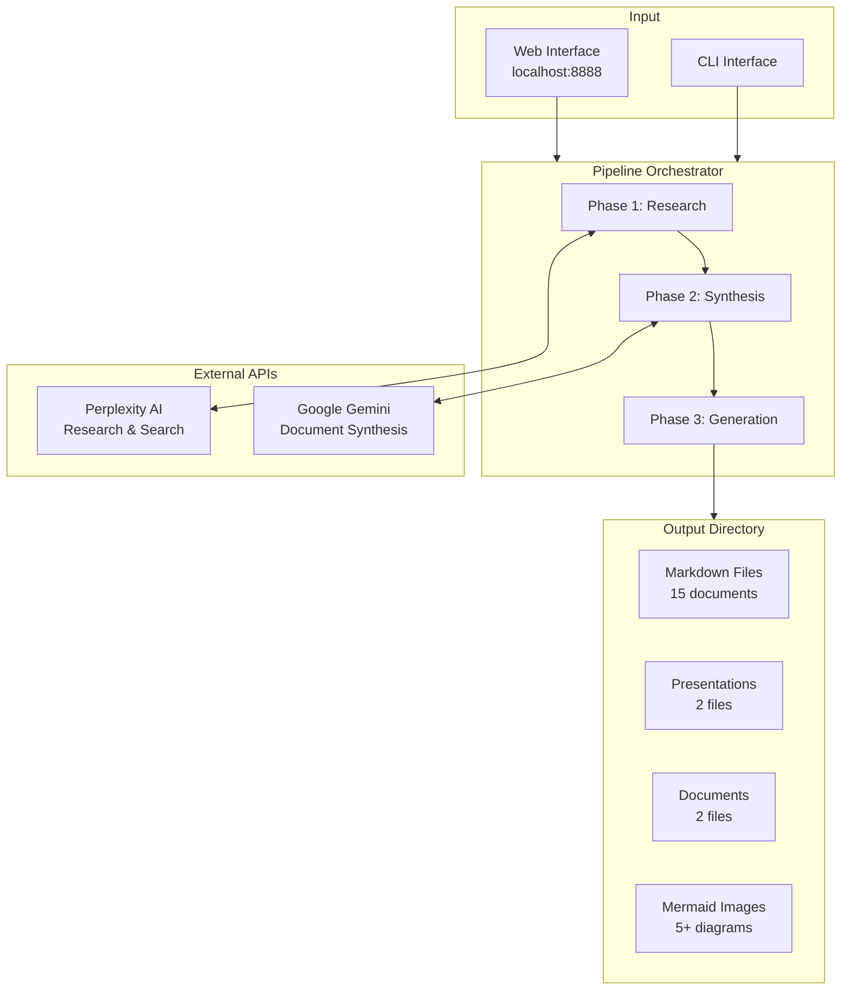
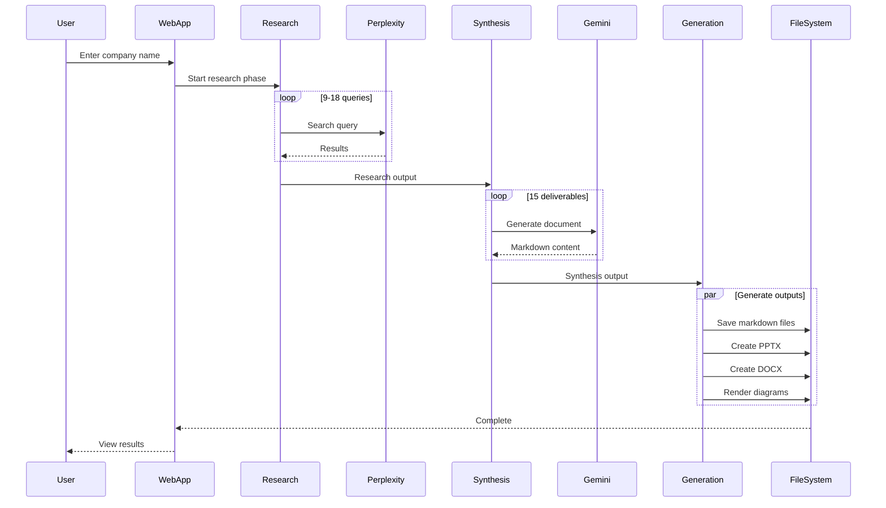
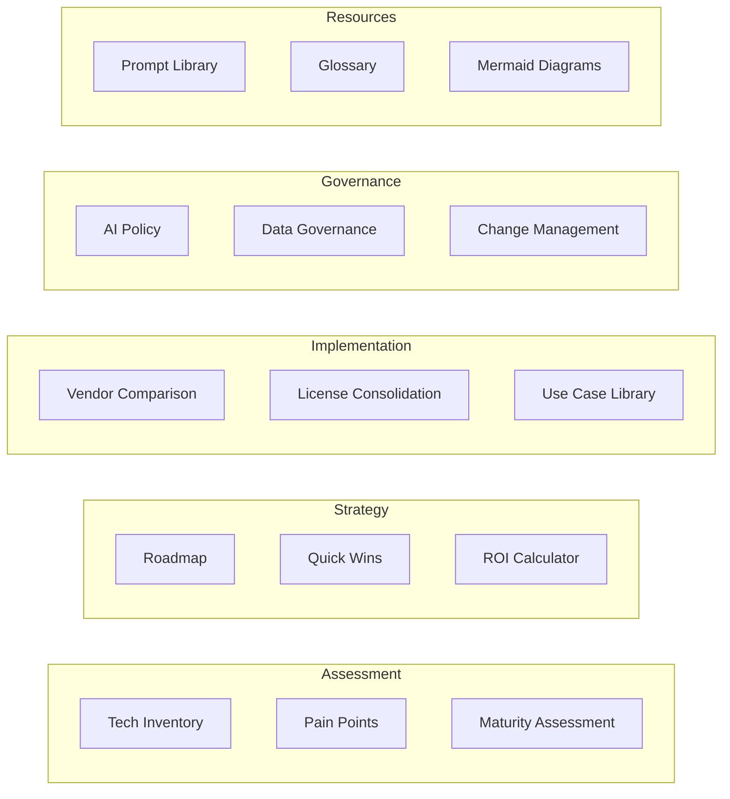
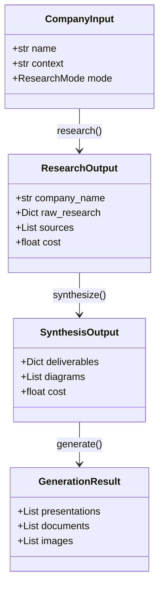
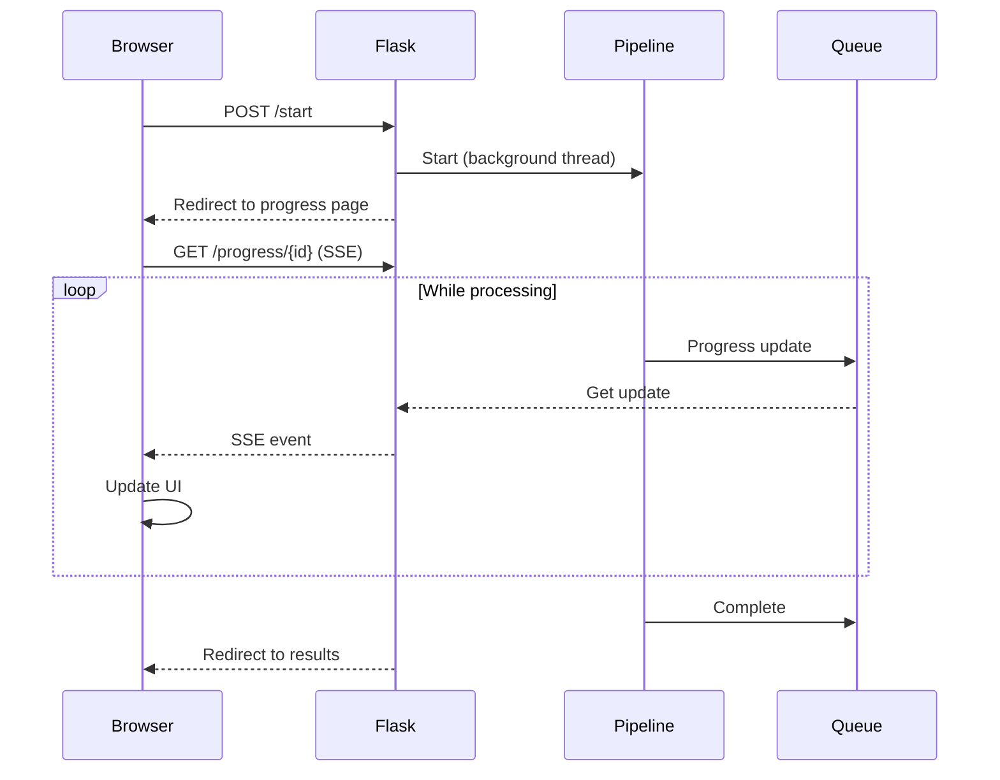

# AI Strategy Factory - Architecture

This document provides a detailed technical overview of the AI Strategy Factory system.

## System Overview



## Pipeline Flow



## Component Details

### Phase 1: Research Orchestrator

**Purpose:** Gather comprehensive information about the target company.

**Location:** `strategy_factory/research/`

```
research/
├── orchestrator.py      # Coordinates research queries
├── perplexity_client.py # API client with retry logic
└── queries.py           # Query templates by category
```

**Query Categories:**
1. Company Overview & Business Model
2. Technology Stack & Infrastructure
3. Industry Landscape & Competitors
4. AI/ML Current Initiatives
5. Pain Points & Challenges
6. Strategic Priorities
7. Organizational Structure
8. Regulatory Environment
9. Recent News & Developments

**Research Modes:**

| Mode | Queries | Models Used | Use Case |
|------|---------|-------------|----------|
| Quick | ~9 | sonar | Rapid assessment |
| Comprehensive | ~18 | sonar, sonar-pro, deep-research | Full strategy |

### Phase 2: Synthesis Orchestrator

**Purpose:** Transform research into strategic deliverables.

**Location:** `strategy_factory/synthesis/`

```
synthesis/
├── orchestrator.py      # Coordinates document generation
├── gemini_client.py     # API client with retry/rate limiting
├── context_builder.py   # Builds prompts from research
└── prompts/             # Deliverable-specific prompts
    ├── tech_inventory.py
    ├── pain_points.py
    ├── mermaid_diagrams.py
    ├── maturity_assessment.py
    ├── roadmap.py
    ├── quick_wins.py
    ├── vendor_comparison.py
    ├── license_consolidation.py
    ├── roi_calculator.py
    ├── ai_policy.py
    ├── data_governance.py
    ├── prompt_library.py
    ├── glossary.py
    ├── use_case_library.py
    └── change_management.py
```

**Deliverables Generated:**



### Phase 3: Generation Orchestrator

**Purpose:** Create final deliverable files.

**Location:** `strategy_factory/generation/`

```
generation/
├── orchestrator.py       # Coordinates file generation
├── pptx_generator.py     # PowerPoint creation
├── docx_generator.py     # Word document creation
└── mermaid_renderer.py   # Diagram rendering
```

**Output Files:**

| Type | Files | Description |
|------|-------|-------------|
| Markdown | 15 | Strategic analysis documents |
| PPTX | 2 | Executive Summary, Full Findings |
| DOCX | 2 | Strategy Report, Statement of Work |
| PNG | 5+ | Architecture diagrams |

## Data Models



## Progress Tracking

The system maintains state in `output/{company}/state.json`:

```json
{
  "company_name": "Stripe",
  "company_slug": "stripe",
  "created_at": "2024-12-01T12:00:00",
  "current_phase": "complete",
  "phases": {
    "research": {"status": "complete", "completed_at": "..."},
    "synthesis": {"status": "complete", "completed_at": "..."},
    "generation": {"status": "complete", "completed_at": "..."}
  },
  "deliverables": {
    "01_tech_inventory": {"status": "complete", "path": "..."},
    ...
  },
  "total_cost": 0.0773
}
```

## Web Application

**Framework:** Flask

**Routes:**

| Route | Method | Description |
|-------|--------|-------------|
| `/` | GET | Home page with form |
| `/start` | POST | Begin new analysis |
| `/progress/{job_id}` | GET | SSE progress stream |
| `/results/{company}` | GET | View results |
| `/api/markdown/{company}/{file}` | GET | Get rendered markdown |
| `/files/{company}/{path}` | GET | Serve static files |

**Real-time Updates:**



## Error Handling

### Retry Logic

Both API clients implement exponential backoff:

```python
max_retries = 3
initial_delay = 1.0  # seconds
max_delay = 30.0     # seconds
backoff_multiplier = 2.0
```

### Rate Limiting

- Perplexity: 2 second delay between requests
- Gemini: 1 second delay between requests

### Graceful Degradation

- If research query fails → Continue with partial data
- If deliverable fails → Mark as failed, continue others
- If diagram rendering fails → Skip image, keep markdown

## Cost Management

**Estimation:**

```python
# Perplexity
sonar: $0.001/1K input, $0.001/1K output
sonar-pro: $0.003/1K input, $0.015/1K output
deep-research: $0.002/1K input, $0.008/1K output

# Gemini
2.5-flash: $0.075/1M input, $0.30/1M output
```

**Tracking:**

- Each API call records token counts
- Running total maintained per session
- Final cost saved in state.json

## Security Considerations

1. **API Keys:** Stored in `.env`, never committed
2. **Output:** Generated in local directory only
3. **No persistent storage:** No database, no cloud storage
4. **User data:** Not collected or transmitted

## Extension Points

### Adding New Deliverables

1. Create prompt in `synthesis/prompts/new_deliverable.py`
2. Register in `config.py` DELIVERABLES dict
3. Orchestrator automatically includes it

### Adding New LLM Providers

1. Create client in `synthesis/new_provider_client.py`
2. Implement `generate()` and `generate_markdown()` methods
3. Update orchestrator to use new client

### Adding New Output Formats

1. Create generator in `generation/new_format_generator.py`
2. Add to GenerationOrchestrator
3. Update config with new format options
